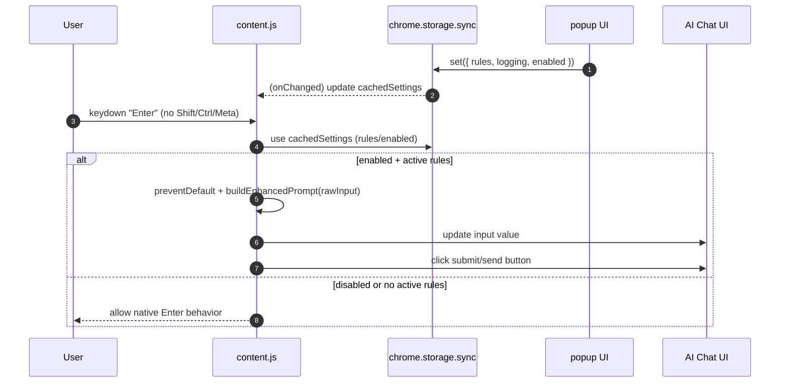

# QuietAI Architecture Diagrams

## High-level components

```mermaid
flowchart LR
  U[User] -->|Opens AI site| Chat[AI Chat UI]
  Chat -->|Typing + Enter| C[content.js (content script)]

  P[popup.html + popup.js] -->|Toggle rules| S[(chrome.storage.sync)]
  C -->|Reads settings| S

  C -->|Enhances prompt| B[buildEnhancedPrompt()]
  C -->|Writes prompt back + clicks send| Chat

  W[background.js (service worker)] -->|onInstalled logging| Brw[Browser console]
```

## Sequence: keydown -> enhance -> send



## Notes

- `content.js` extracts the prompt via input selectors and uses capture-phase `keydown` handling (`addEventListener(..., true)`).
- `popup.js` checkbox `id`s and `content.js` `PROMPT_ENHANCEMENTS` keys must remain aligned for rules to work.

